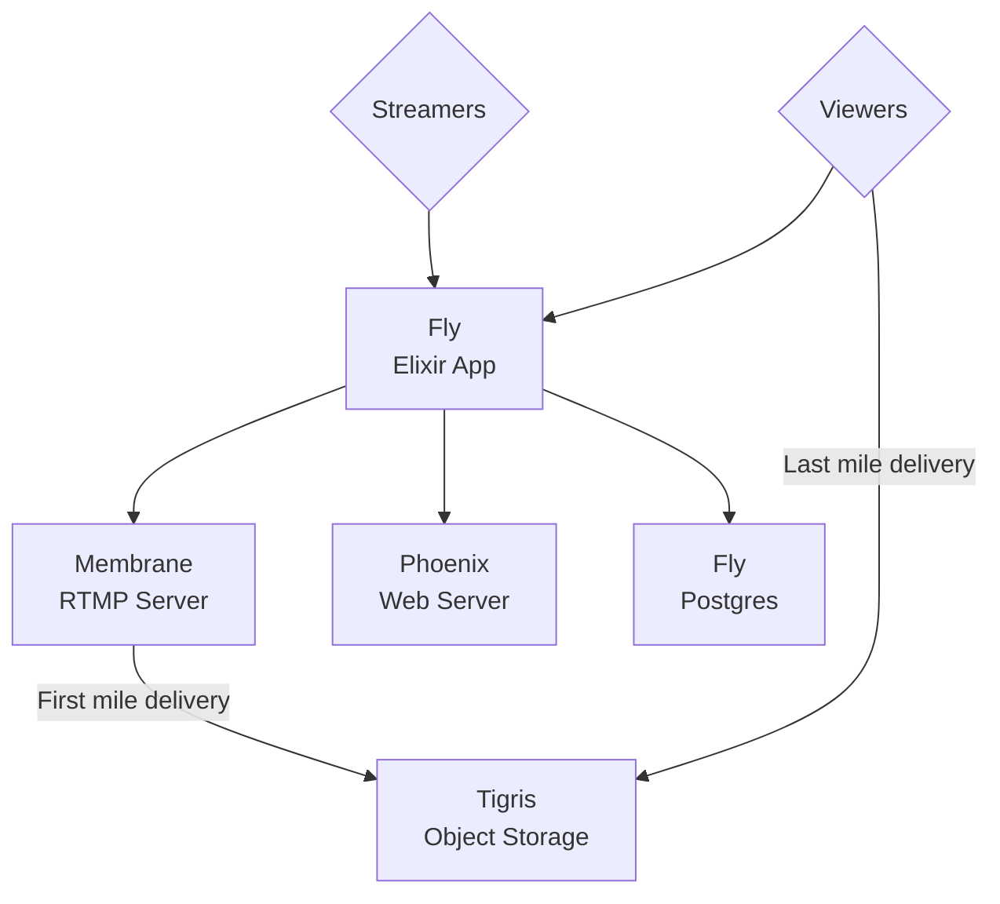
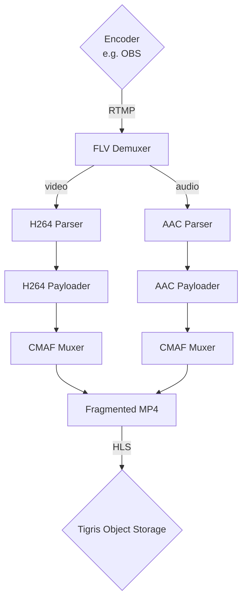

<!-- PROJECT LOGO -->
<p align="center">
  <a href="https://github.com/algora-io/tv">
   
  </a>

  <h3 align="center">Algora TV</h3>

  <p align="center">
    The interactive livestreaming & video sharing service for developers.
    <br />
    <a href="https://algora.io/discord">Discord</a>
    ·
    <a href="https://twitter.com/algoraio">Twitter</a>
    ·
    <a href="https://www.youtube.com/@algora-io">YouTube</a>
    ·
    <a href="https://github.com/algora-io/tv/issues">Issues</a>
  </p>
  
  <p align="center">
    <a href="https://algora.io/algora/bounties?status=open">
      
    </a>
    <a href="https://algora.io/algora/bounties?status=completed">
      
    </a>
  </p>
</p>

## ✨ New feature: Earn with Livestream Billboards! ✨

Algora Live Billboards allow for in-video ads, helping devs earn money while livestreaming and giving devtools companies a novel channel to reach new audiences.

https://github.com/user-attachments/assets/6f706a4b-210f-4ec8-a817-2a72cea0954a

<!-- GETTING STARTED -->

## Getting Started

To get a local copy up and running, follow these steps.

### Prerequisites

- Elixir and Erlang/OTP
  - We recommend using [asdf](https://github.com/asdf-vm/asdf) to install [Elixir](https://github.com/asdf-vm/asdf-elixir) and [Erlang/OTP](https://github.com/asdf-vm/asdf-erlang).
  - Keep in mind that each Elixir version supports [specific Erlang/OTP versions](https://hexdocs.pm/elixir/compatibility-and-deprecations.html#between-elixir-and-erlang-otp).
  - Make sure you have at least **Elixir 1.17.3** and **Erlang 27.1** installed to run Algora TV.
- PostgreSQL
- FFmpeg
- ImageMagick
- OBS Studio (recommended for testing livestreaming features)

### Setting up the project

1. Clone the repo and go to the project folder

   ```sh
   git clone https://github.com/algora-io/tv.git; cd tv
   ```

2. Fetch dependencies

   ```sh
   mix deps.get
   ```

   **Note:** If you're using an Apple machine with an ARM-based chip, you need to install the Rust compiler and run `mix compile.rambo`

3. Initialize your `.env` file

   ```sh
   cp .env.example .env
   ```

4. Create the database user that will manage the database

   ```sh
   sudo -u postgres psql
   ```

   ```sql
   CREATE USER algora WITH PASSWORD 'password';
   ALTER USER algora WITH CREATEDB;
   \q
   ```

   Update the `.env` file as needed with the username and password you used.

5. Set up and seed your database

   ```sh
   env $(cat .env | xargs -L 1) mix ecto.setup
   ```

6. Start your development server

   ```sh
   env $(cat .env | xargs -L 1) iex -S mix phx.server
   ```

### Setting up external services

Some features of Algora TV rely on external services. If you're not planning on using these features, feel free to skip setting them up.

#### GitHub

GitHub is used for authenticating users.

[Create a GitHub OAuth app](https://github.com/settings/applications/new) and set

- Homepage URL: http://localhost:4000
- Authorization callback URL: http://localhost:4000/oauth/callbacks/github

Once you have obtained your client ID and secret, add them to your `.env` file.

```env
GITHUB_CLIENT_ID=""
GITHUB_CLIENT_SECRET="..."
```

#### Tigris

Tigris is used for storing and delivering livestreams and other media.

[Create a public Tigris bucket](https://console.tigris.dev/) to obtain your secrets and add them to your `.env` file.

```env
AWS_ENDPOINT_URL_S3="https://fly.storage.tigris.dev"
AWS_REGION="auto"
AWS_ACCESS_KEY_ID="tid_..."
AWS_SECRET_ACCESS_KEY="tsec_..."
BUCKET_MEDIA="..."
RESUME_RTMP=true
```

<!-- ARCHITECTURE -->

## Architecture

### Overview



### Livestream pipeline



<!-- LICENSE -->

## License

Distributed under the [AGPLv3 License](https://github.com/algora-io/tv/blob/main/LICENSE). See `LICENSE` for more information.

<!-- ACKNOWLEDGEMENTS -->

## Acknowledgements

Special thanks to these amazing projects which help power Algora TV:

- [Tigris](https://www.tigrisdata.com/)
- [Fly.io](https://fly.io/)
- [Phoenix Framework](https://www.phoenixframework.org/)
- [Ecto](https://github.com/elixir-ecto/ecto)
- [Membrane](https://membrane.stream/)
- [FFmpeg](https://ffmpeg.org/)
- [Tailwind CSS](https://tailwindcss.com/)
