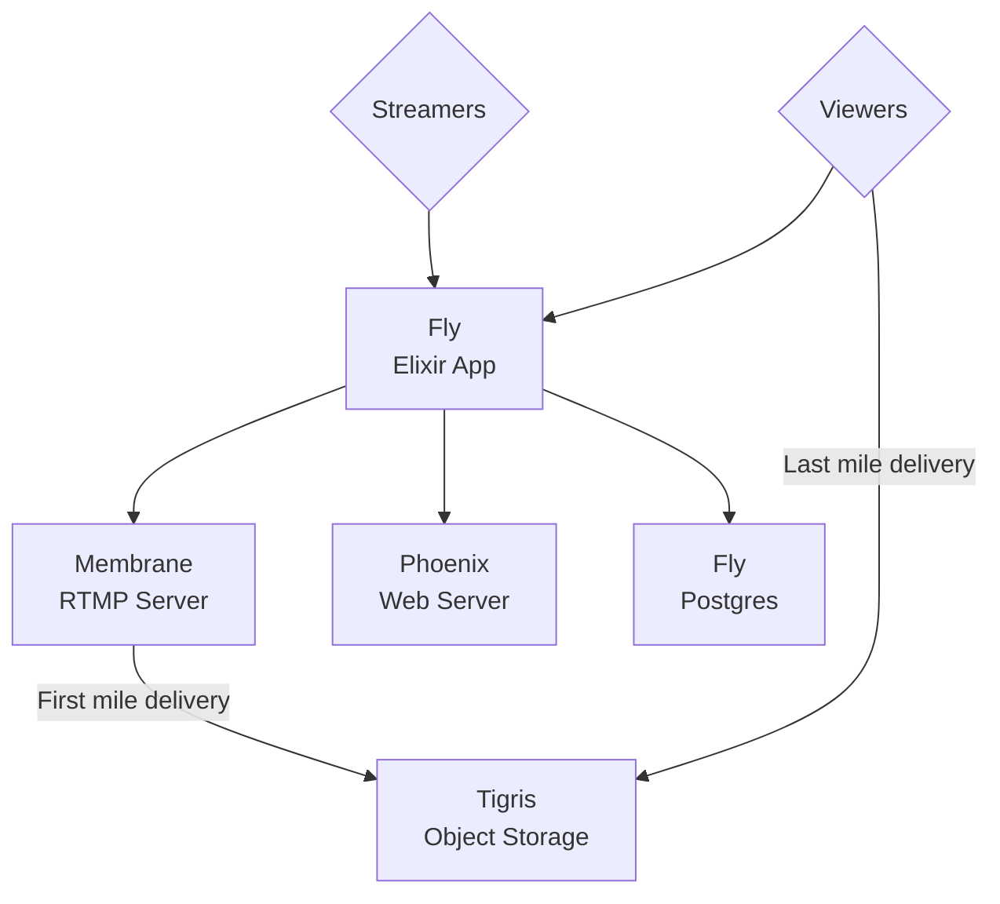
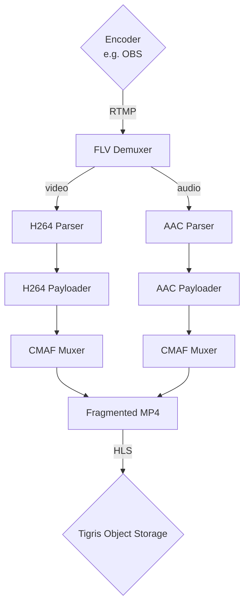

<!-- PROJECT LOGO -->
<p align="center">
  <a href="https://github.com/algora-io/tv">
   
  </a>

  <h3 align="center">Algora TV</h3>

  <p align="center">
    The interactive livestreaming & video sharing service for developers.
    <br />
    <a href="https://tv.algora.io">Website</a>
    ·
    <a href="https://algora.io/discord">Discord</a>
    ·
    <a href="https://twitter.com/algoraio">Twitter</a>
    ·
    <a href="https://www.youtube.com/@algora-io">YouTube</a>
    ·
    <a href="https://github.com/algora-io/tv/issues">Issues</a>
  </p>
  
  <p align="center">
    <a href="https://console.algora.io/org/algora/bounties?status=open">
      
    </a>
    <a href="https://console.algora.io/org/algora/bounties?status=completed">
      
    </a>
  </p>
</p>

## Architecture

### Overview



### Livestream pipeline



<!-- GETTING STARTED -->

## Getting Started

To get a local copy up and running, please follow these steps.

### Prerequisites

Here is what you need to be able to run Algora TV.

- Elixir (Version: >=1.12)
- OTP
- PostgreSQL
- FFmpeg

## Development

### Setup

1. Clone the repo into a public GitHub repository (or fork https://github.com/algora-io/tv/fork).

   ```sh
   git clone https://github.com/algora-io/tv.git
   ```

2. Go to the project folder

   ```sh
   cd tv
   ```

3. Install dependencies with mix

   ```sh
   mix deps.get
   ```

4. Set up your `.env` file

   - Duplicate `.env.example` to `.env`
   - Add your environment variables in the `.env` file

5. Create and migrate your database with mix

   ```sh
   mix ecto.setup
   ```

6. Start your development server

   ```sh
   env $(cat .env | xargs -L 1) iex -S mix phx.server
   ```

<!-- LICENSE -->

## License

Distributed under the [AGPLv3 License](https://github.com/algora-io/tv/blob/main/LICENSE). See `LICENSE` for more information.

<!-- ACKNOWLEDGEMENTS -->

## Acknowledgements

Special thanks to these amazing projects which help power Algora TV:

- [Tigris](https://www.tigrisdata.com/)
- [Fly.io](https://fly.io/)
- [Phoenix Framework](https://www.phoenixframework.org/)
- [Ecto](https://github.com/elixir-ecto/ecto)
- [Membrane](https://membrane.stream/)
- [FFmpeg](https://ffmpeg.org/)
- [Tailwind CSS](https://tailwindcss.com/)
